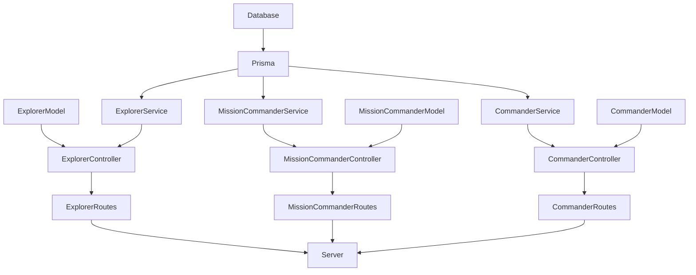

# Prisma API - REST

> This is the exercise from LaunchX of the week 5.

## Some libraries were used in this project:

- [Express](https://www.npmjs.com/package/express) - Node.js framework
- [Jest](https://jestjs.io/) - for testing
- [Eslint](https://eslint.org/) - for code style checking
- [Prisma](https://www.prisma.io/) - for database
- [Cors](https://github.com/expressjs/cors) - for CORS

If you want to download the project don't forget to run **`npm i`** to install the necessary dependencies

There are some scripts in the package.json to speed up some commands:
```javascript
"scripts": {
    "test": "node ./node_modules/jest/bin/jest.js",
    "start": "node lib/server.js",
    "seed": "node prisma/seed.js",
    "linter": "node ./node_modules/eslint/bin/eslint.js .",
    "linter-fix": "node ./node_modules/eslint/bin/eslint.js . --fix"
},
```

- `npm run test` = To run the tests
- `npm run start` = To stand up the server
- `npm run seed` = To insert data into the database
- `npm run linter` = To examine the code according to the rules imposed in the .eslintrc.js file
- `npm run linter-fix` = To resolve errors according to the rules

## The logic distribution of this api is like this


## These are the available **endpoints**.
| Endpoint | Description | Body |
|---|---|---|
| `http://localhost:3000/explorers` | Get the list of explorers | |
| `http://localhost:3000/explorers/:id` | Get the explorer by id | |
| `http://localhost:3000/explorers` | Post a new explorer | { name: "Woopa", username: "ajolonauta",mission: "Node" } |
| `http://localhost:3000/explorers/:id` | Update an explorer | { name: "Woopa", username: "ajolonauta",mission: "Java" } |
| `http://localhost:3000/explorers/:id` | Delete an explorer | |
| `http://localhost:3000/commanders` | Get the list of commanders | |
| `http://localhost:3000/commanders/:id` | Get the commander by id | |
| `http://localhost:3000/commanders` | Post a new commander | { name: "Juan", lang: "English", missionCommander: "Rodrigo", enrollments: 10, } |
| `http://localhost:3000/commanders/:id` | Update an commander | { name: "Juan", lang: "English", missionCommander: "Carlo", enrollments: 10, } |
| `http://localhost:3000/commanders/:id` | Delete an commander | |
| `http://localhost:3000/missionCommander` | Get the list of mission commanders | |
| `http://localhost:3000/missionCommander/:id` | Get the mission commander by id | |
| `http://localhost:3000/missionCommander` | Post a new mission commander | { "name": "Rodolfo", "username": "rodoFerro", "mainStack": "Python", "currentEnrollment": false, "hasAzureCertification": true } |
| `http://localhost:3000/missionCommander/:id` | Update an mission commander | { "name": "Rodolfo", "username": "rodoFerro", "mainStack": "Python", "currentEnrollment": false, "hasAzureCertification": true } |
| `http://localhost:3000/missionCommander/:id` | Delete an mission commander | |

## Demo
### Explorers


### Commanders


### Missions Commanders

